<h1 align="center">
  <picture>
    <source media="(prefers-color-scheme: dark)" srcset="branding/banner-transparent-dark.png">
    
  </picture>
</h1>
<h3 align="center">Diagrams that move, explain and export themselves.</h3>

<p align="center">Ask your agent for a diagram. SeeCode turns a short spec into an editorial-quality, animated, explorable diagram: one HTML file you can hover, click and walk through, or export as SVG, PNG, GIF or MP4 for wherever it needs to go.</p>

<p align="center">
  <a href="#install"><strong>Install</strong></a> &nbsp;·&nbsp;
  <a href="#42-diagram-types"><strong>Diagram types</strong></a> &nbsp;·&nbsp;
  <a href="#see-it-in-action"><strong>Features</strong></a> &nbsp;·&nbsp;
  <a href="#themes-and-your-brand"><strong>Themes</strong></a> &nbsp;·&nbsp;
  <a href="#bring-what-you-already-have"><strong>Import</strong></a> &nbsp;·&nbsp;
  <a href="#export-for-wherever-it-goes"><strong>Export</strong></a> &nbsp;·&nbsp;
  <a href="docs/cli.md"><strong>CLI</strong></a>
</p>

<p align="center">
  <a href="https://github.com/Aryanutkarsh/seecode/stargazers"></a>
  <a href="https://github.com/Aryanutkarsh/seecode/actions/workflows/ci.yml"></a>
  <a href="https://github.com/Aryanutkarsh/seecode/blob/main/package.json"></a>
  <a href="skills/seecode/SKILL.md"></a>
  
  <a href="LICENSE"></a>
</p>

<p align="center"></p>

<p align="center"><sub>Exported straight from the diagram. ▶ <a href="#see-it-in-action">See the viewer in action</a>: hover trace, focus panel, route journey.</sub></p>

## Install, then describe what you want to see

```bash
npx skills add Aryanutkarsh/seecode -g
```

Works with Claude Code, Cursor, Codex, OpenCode and other Agent Skills hosts. [More install options](#install).

Then ask:

```text
Use SeeCode to show how checkout works: the browser calls the API,
the API writes to Postgres, charges Stripe and publishes an event to Kafka.
```

Keep going in plain language: *"highlight the payment path"*, *"make it dark"*, *"export it for my slides"*. The first time you use it in a project, SeeCode asks once whether to use your global settings or create project-specific ones.

## 45 diagram types

Every type animates its own way (systems trace their flows, sequences play message by message, charts grow), and every type can also be fully static. Click any diagram for the full-size image. Charts take their numbers from a CSV or JSON file, so the data never has to pass through the model.

<table>
<tr>
  <td align="center" width="33%"><a href="docs/screenshots/architecture.png">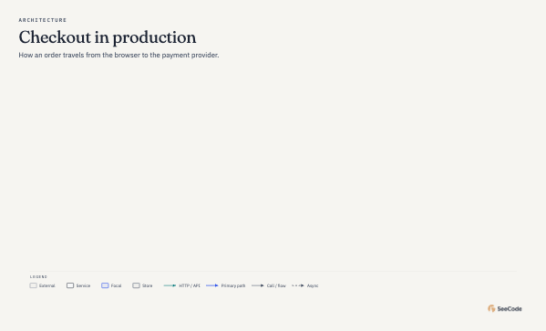</a><br><b>Architecture</b><br><sub>Components and connections</sub></td>
  <td align="center" width="33%"><a href="docs/screenshots/high-level.png">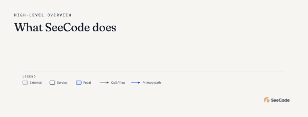</a><br><b>High-level</b><br><sub>4–7-box overview for non-engineers</sub></td>
  <td align="center" width="33%"><a href="docs/screenshots/deployment.png">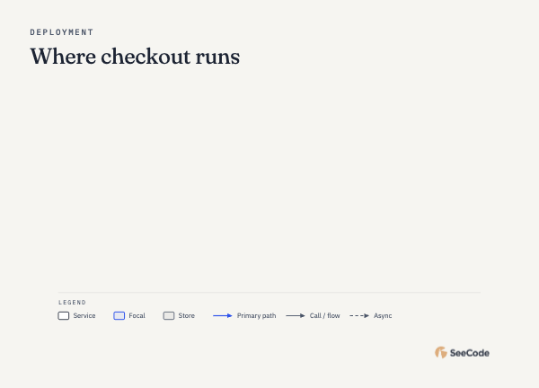</a><br><b>Deployment</b><br><sub>Where things run (hosts, regions)</sub></td>
</tr>
<tr>
  <td align="center" width="33%"><a href="docs/screenshots/dependency.png">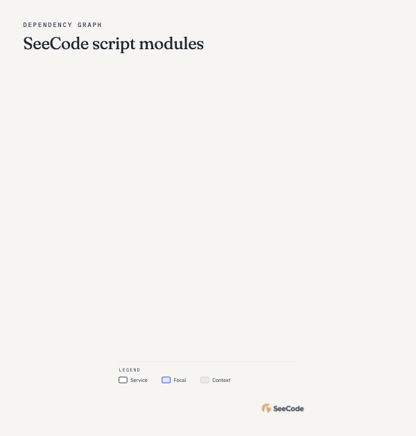</a><br><b>Dependency graph</b><br><sub>What imports or depends on what</sub></td>
  <td align="center" width="33%"><a href="docs/screenshots/architecture-delta.png">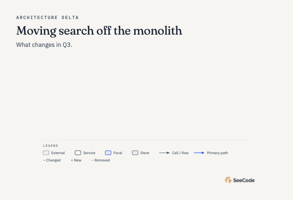</a><br><b>Architecture delta</b><br><sub>What a change adds, removes or alters</sub></td>
  <td align="center" width="33%"><a href="docs/screenshots/it-state.png">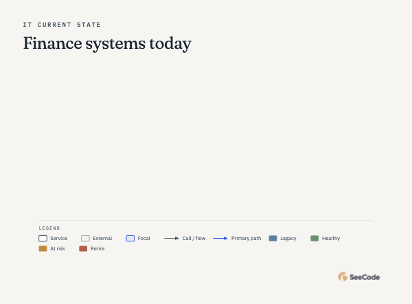</a><br><b>IT current state</b><br><sub>Current IT landscape with health status</sub></td>
</tr>
<tr>
  <td align="center" width="33%"><a href="docs/screenshots/uml-class.png"></a><br><b>UML class</b><br><sub>Classes and interfaces</sub></td>
  <td align="center" width="33%"><a href="docs/screenshots/er.png">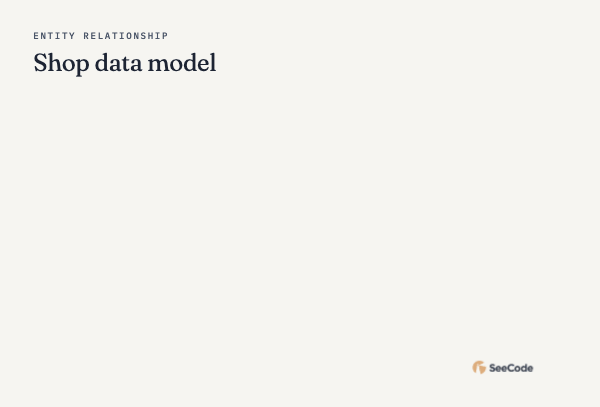</a><br><b>ER / data model</b><br><sub>Entities and cardinality</sub></td>
  <td align="center" width="33%"><a href="docs/screenshots/db-schema.png">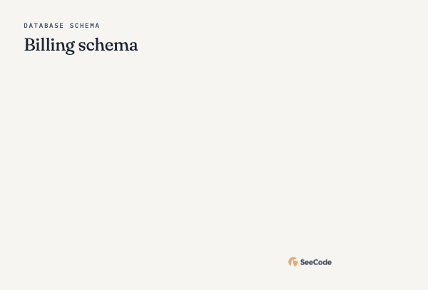</a><br><b>Database schema</b><br><sub>Tables and FK columns</sub></td>
</tr>
<tr>
  <td align="center" width="33%"><a href="docs/screenshots/flowchart.png">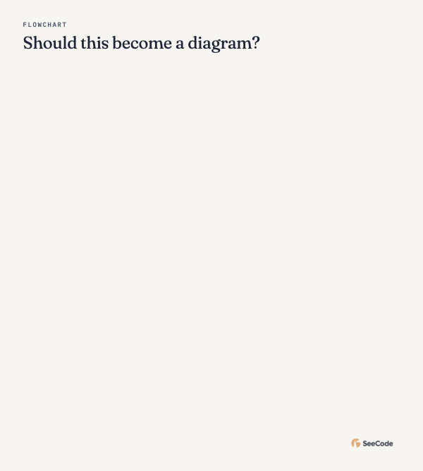</a><br><b>Flowchart</b><br><sub>Decisions and branches</sub></td>
  <td align="center" width="33%"><a href="docs/screenshots/sequence.png">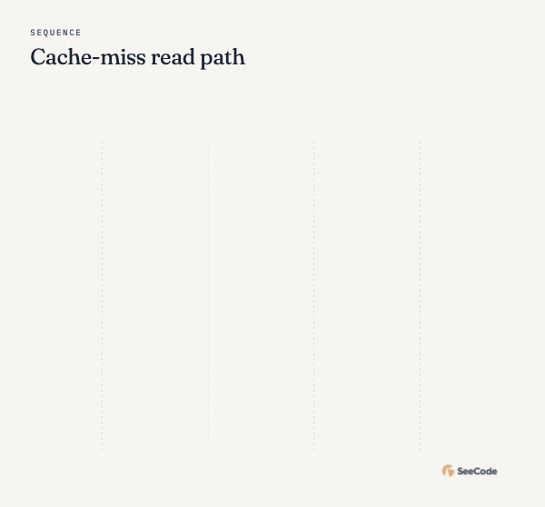</a><br><b>Sequence</b><br><sub>Messages between actors over time</sub></td>
  <td align="center" width="33%"><a href="docs/screenshots/state.png">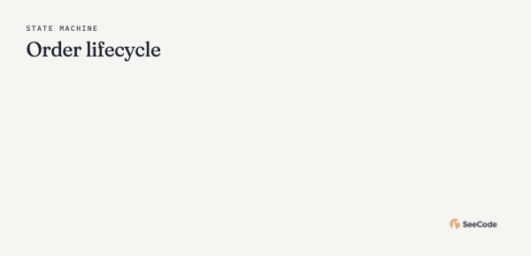</a><br><b>State machine</b><br><sub>States and transitions</sub></td>
</tr>
<tr>
  <td align="center" width="33%"><a href="docs/screenshots/swimlane.png">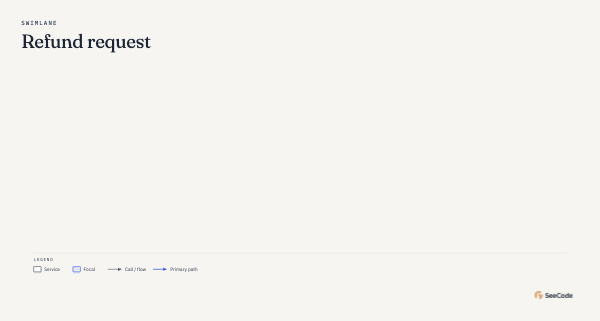</a><br><b>Swimlane</b><br><sub>Who does which step</sub></td>
  <td align="center" width="33%"><a href="docs/screenshots/process.png">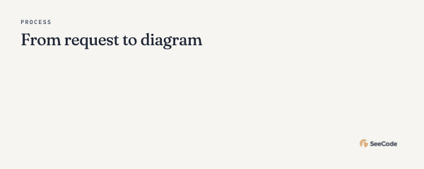</a><br><b>Process</b><br><sub>Short linear numbered steps</sub></td>
  <td align="center" width="33%"><a href="docs/screenshots/data-flow.png">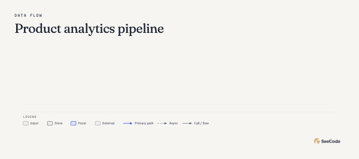</a><br><b>Data flow</b><br><sub>Data moving through stages</sub></td>
</tr>
<tr>
  <td align="center" width="33%"><a href="docs/screenshots/journey.png">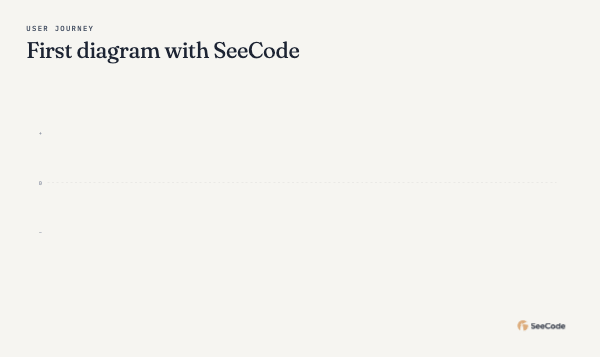</a><br><b>User journey</b><br><sub>User steps and emotion curve</sub></td>
  <td align="center" width="33%"><a href="docs/screenshots/timeline.png">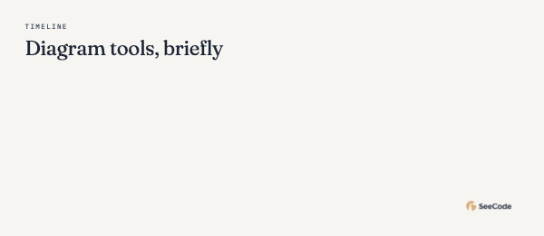</a><br><b>Timeline</b><br><sub>Dated events</sub></td>
  <td align="center" width="33%"><a href="docs/screenshots/gantt.png">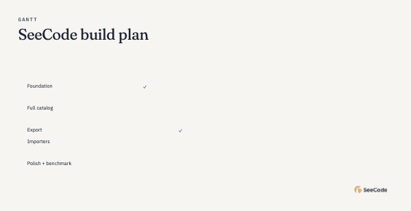</a><br><b>Gantt</b><br><sub>Work over time</sub></td>
</tr>
<tr>
  <td align="center" width="33%"><a href="docs/screenshots/kanban.png"></a><br><b>Kanban</b><br><sub>Items by status</sub></td>
  <td align="center" width="33%"><a href="docs/screenshots/story-map.png">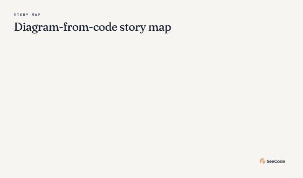</a><br><b>Story map</b><br><sub>Backbone and release slices</sub></td>
  <td align="center" width="33%"><a href="docs/screenshots/loop.png">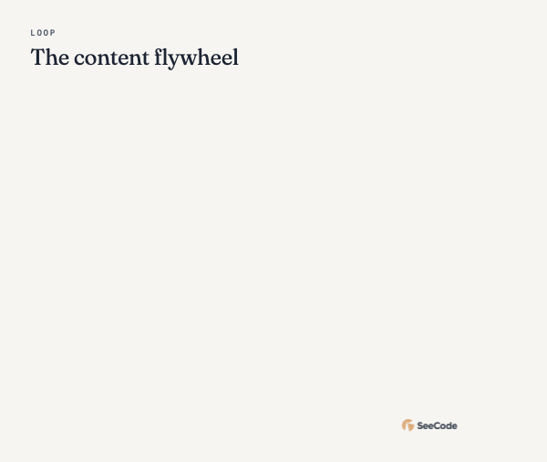</a><br><b>Loop / flywheel</b><br><sub>Reinforcing cycle or flywheel</sub></td>
</tr>
<tr>
  <td align="center" width="33%"><a href="docs/screenshots/medallion.png">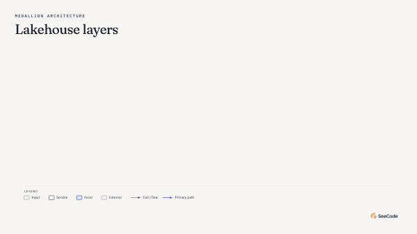</a><br><b>Medallion</b><br><sub>Bronze/silver/gold layers</sub></td>
  <td align="center" width="33%"><a href="docs/screenshots/dp-integration.png">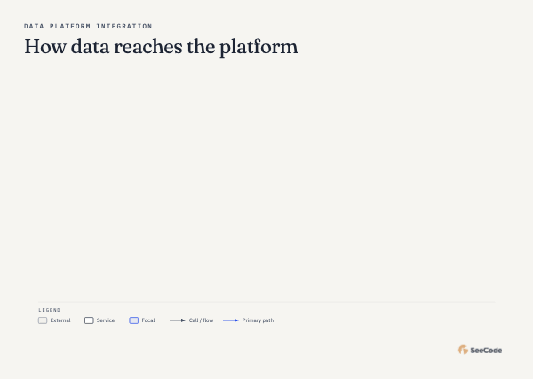</a><br><b>Platform integration</b><br><sub>Sources → integration → platform → serving</sub></td>
  <td align="center" width="33%"><a href="docs/screenshots/dp-security-matrix.png">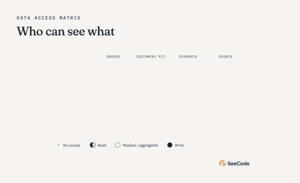</a><br><b>Access matrix</b><br><sub>Roles × data access</sub></td>
</tr>
<tr>
  <td align="center" width="33%"><a href="docs/screenshots/tree.png"></a><br><b>Tree</b><br><sub>Parent → children</sub></td>
  <td align="center" width="33%"><a href="docs/screenshots/org-chart.png">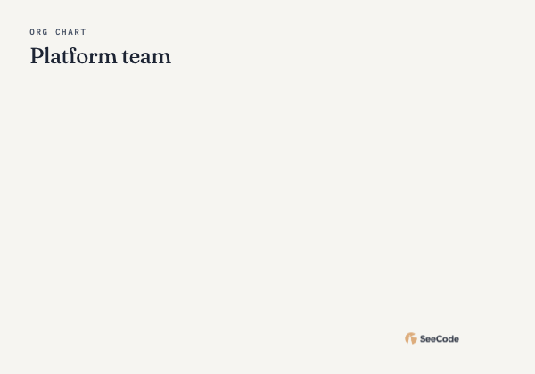</a><br><b>Org chart</b><br><sub>People and teams</sub></td>
  <td align="center" width="33%"><a href="docs/screenshots/nested.png">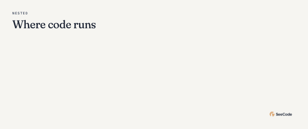</a><br><b>Nested</b><br><sub>Containment and scopes</sub></td>
</tr>
<tr>
  <td align="center" width="33%"><a href="docs/screenshots/layers.png">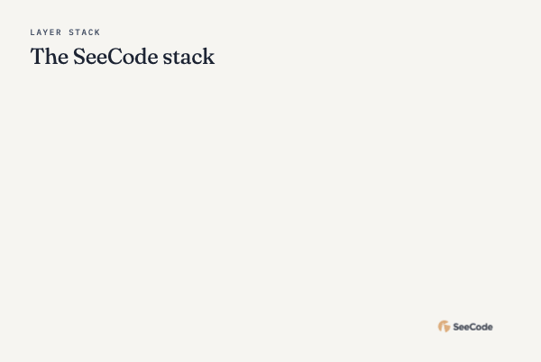</a><br><b>Layer stack</b><br><sub>A stack</sub></td>
  <td align="center" width="33%"><a href="docs/screenshots/venn.png">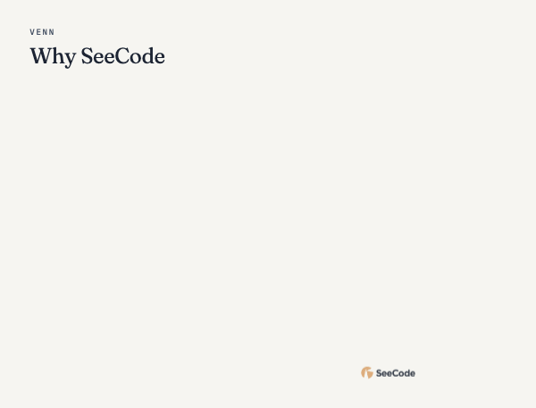</a><br><b>Venn</b><br><sub>Overlaps</sub></td>
  <td align="center" width="33%"><a href="docs/screenshots/pyramid.png"></a><br><b>Pyramid / funnel</b><br><sub>Ranking</sub></td>
</tr>
<tr>
  <td align="center" width="33%"><a href="docs/screenshots/quadrant.png">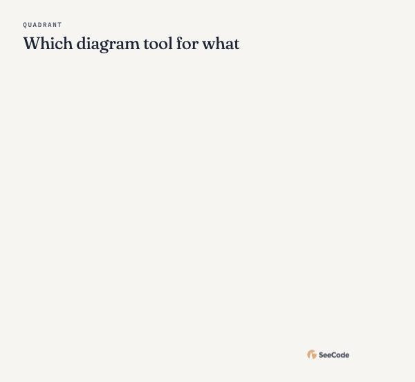</a><br><b>Quadrant</b><br><sub>A 2×2</sub></td>
  <td align="center" width="33%"><a href="docs/screenshots/fishbone.png">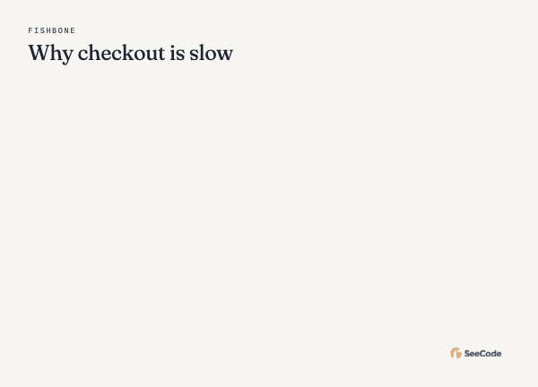</a><br><b>Fishbone</b><br><sub>Root causes</sub></td>
  <td align="center" width="33%"><a href="docs/screenshots/wardley.png">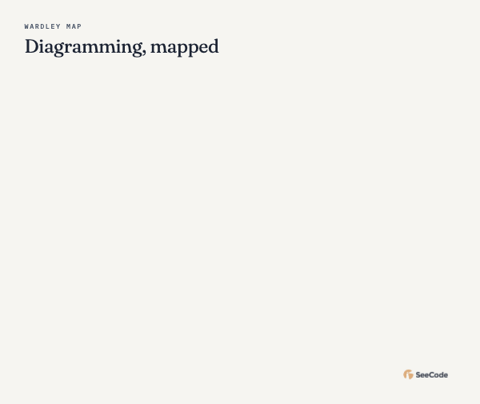</a><br><b>Wardley map</b><br><sub>Evolution × visibility</sub></td>
</tr>
<tr>
  <td align="center" width="33%"><a href="docs/screenshots/exploded.png">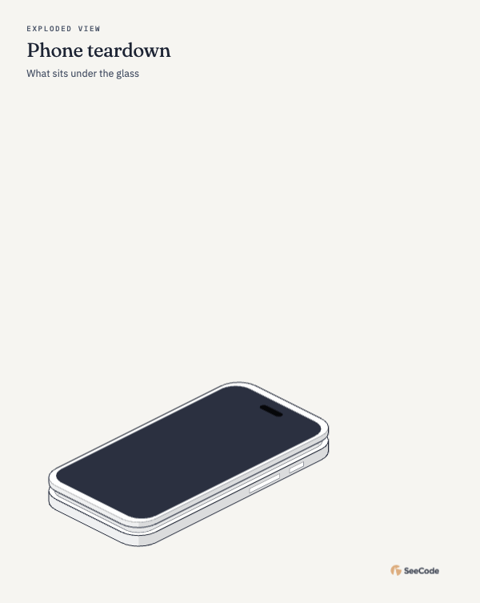</a><br><b>Exploded view</b><br><sub>Parts of one thing, isometric</sub></td>
  <td align="center" width="33%"><a href="docs/screenshots/isometric-plan.png">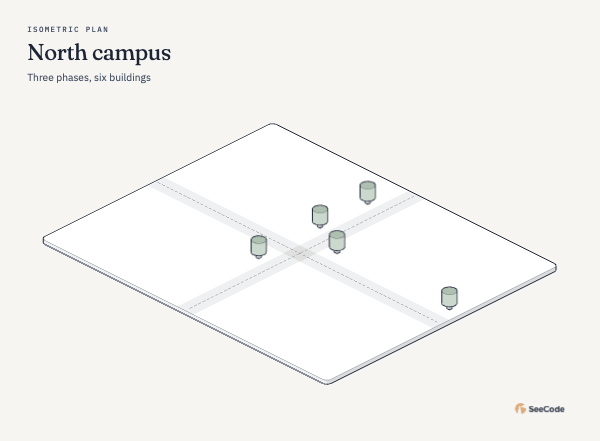</a><br><b>Isometric plan</b><br><sub>A floor or site from above</sub></td>
  <td align="center" width="33%"><a href="docs/screenshots/isometric.png"></a><br><b>Isometric object</b><br><sub>Any object, from a description</sub></td>
</tr>
<tr>
  <td align="center" width="33%"><a href="docs/screenshots/bar.png">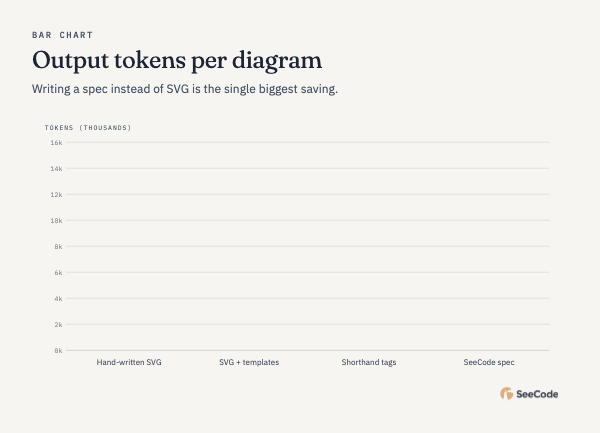</a><br><b>Bar</b><br><sub>Compare amounts</sub></td>
  <td align="center" width="33%"><a href="docs/screenshots/line.png">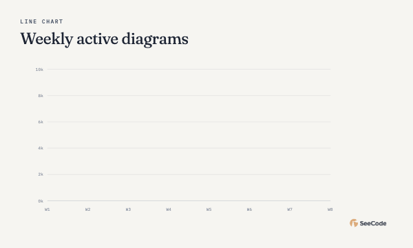</a><br><b>Line</b><br><sub>Change over time</sub></td>
  <td align="center" width="33%"><a href="docs/screenshots/scatter.png">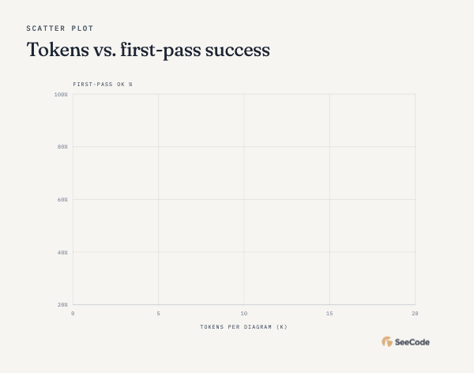</a><br><b>Scatter</b><br><sub>Two measures</sub></td>
</tr>
<tr>
  <td align="center" width="33%"><a href="docs/screenshots/waterfall.png">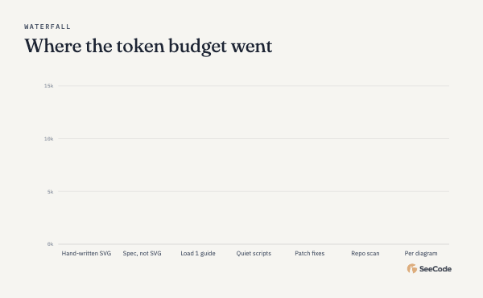</a><br><b>Waterfall</b><br><sub>Running total</sub></td>
  <td align="center" width="33%"><a href="docs/screenshots/treemap.png">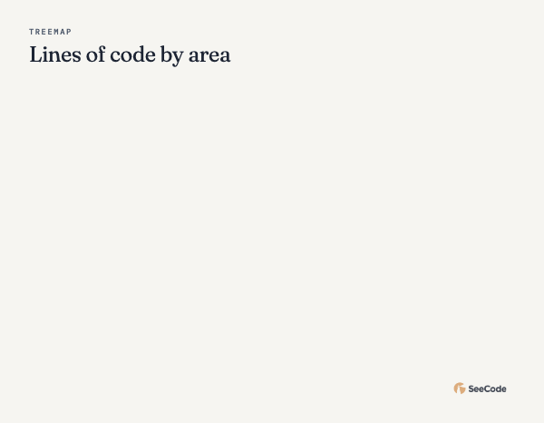</a><br><b>Treemap</b><br><sub>Part of whole</sub></td>
  <td align="center" width="33%"><a href="docs/screenshots/heatmap.png">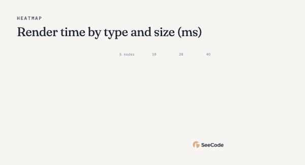</a><br><b>Heatmap</b><br><sub>Intensity grid</sub></td>
</tr>
<tr>
  <td align="center" width="33%"><a href="docs/screenshots/radar.png">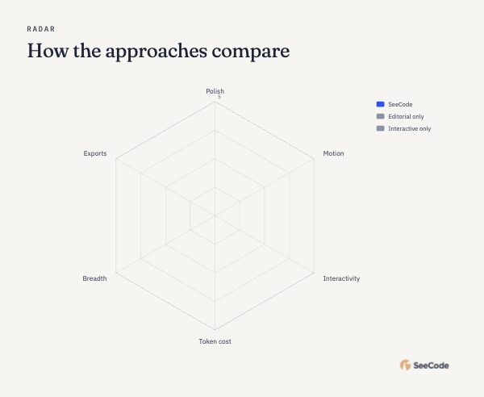</a><br><b>Radar</b><br><sub>Profile on shared axes</sub></td>
  <td align="center" width="33%"><a href="docs/screenshots/polar.png">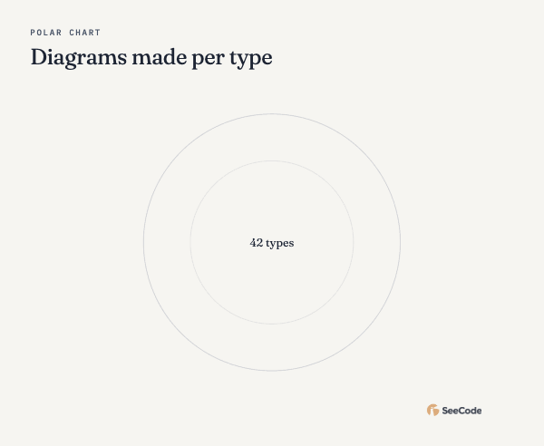</a><br><b>Polar</b><br><sub>Cyclical values</sub></td>
  <td align="center" width="33%"><a href="docs/screenshots/sankey.png">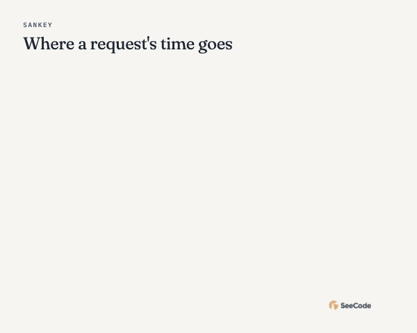</a><br><b>Sankey</b><br><sub>Flow volumes</sub></td>
</tr>
</table>

<sub>Plus 15 variants: dumbbell, marimekko, slopegraph, bump, streamgraph, ridgeline, bubble, beeswarm, funnel, consultant quadrant, terminal loop, OAuth sequence, lifecycle state, block decomposition and vertical high-level. Specs for every example are in <a href="examples/specs/">examples/specs</a>.</sub>

### Isometric: compose anything

Three types draw in isometric 3D: **isometric objects** (anything, from a plain description: ask for *"an office chair"* and the agent lists its parts and SeeCode draws it), **exploded views** (the parts of one thing, lifted apart and labelled, assembling on load) and **isometric plans** (a floor or a site, built up phase by phase). There is no fixed library of drawings: every part is a solid or a beam you place in 3D and dress with items on its top and sides (screens, chips, keys, cards, windows, shelves), make hollow, round, ribbed, lay on its side, or cap with a dome or a roof. So the same few lines of spec draw a chair, a van, a phone, a burger or a street. [How it works](skills/seecode/references/isometric.md)

```text
Use SeeCode to draw an office chair in isometric, and label the parts.
```

<table>
<tr>
  <td align="center" width="25%"><a href="docs/screenshots/isometric.png"></a><br><b>Office chair</b><br><sub>Star base, gas lift, cushion</sub></td>
  <td align="center" width="25%"><a href="docs/screenshots/laptop.png">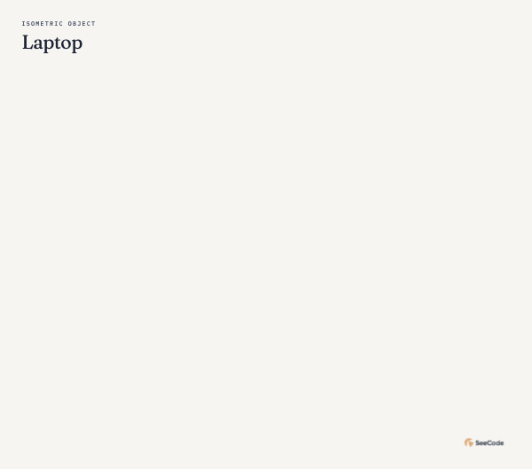</a><br><b>Laptop</b><br><sub>Keys, trackpad, display</sub></td>
  <td align="center" width="25%"><a href="docs/screenshots/espresso-machine.png">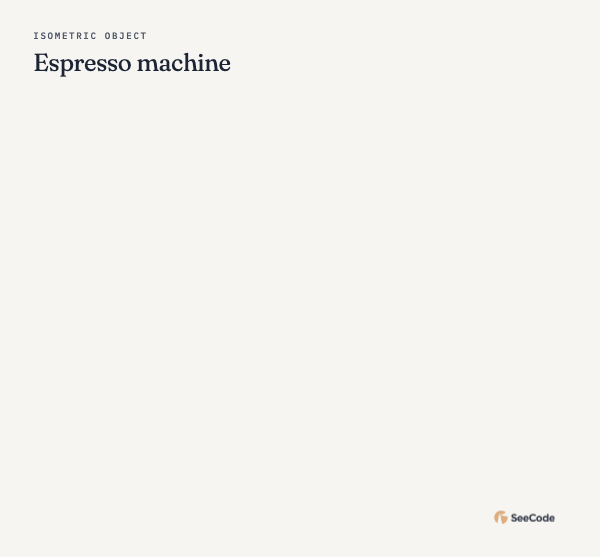</a><br><b>Espresso machine</b><br><sub>Group head, wand, cups</sub></td>
  <td align="center" width="25%"><a href="docs/screenshots/delivery-van.png">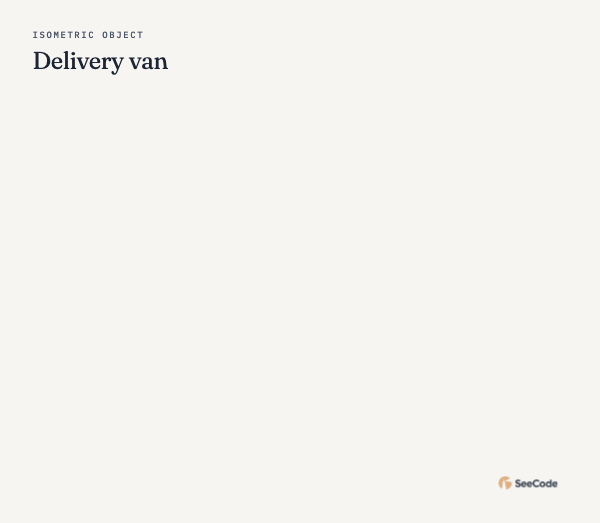</a><br><b>Delivery van</b><br><sub>Wheels on their side</sub></td>
</tr>
</table>

<table>
<tr>
  <td align="center" width="33%"><a href="docs/screenshots/exploded.png"></a><br><b>Phone teardown</b><br><sub>Tray housing, camera module, display</sub></td>
  <td align="center" width="33%"><a href="docs/screenshots/keyboard.png">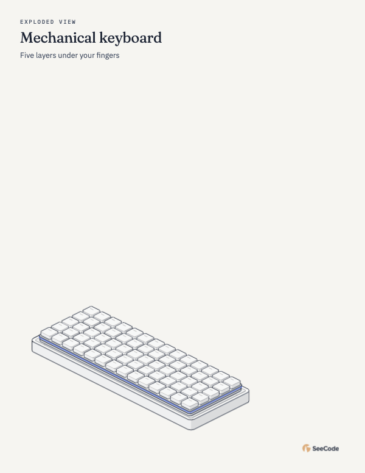</a><br><b>Mechanical keyboard</b><br><sub>Case, PCB, plate, switches, keycaps</sub></td>
  <td align="center" width="33%"><a href="docs/screenshots/agent-stack.png">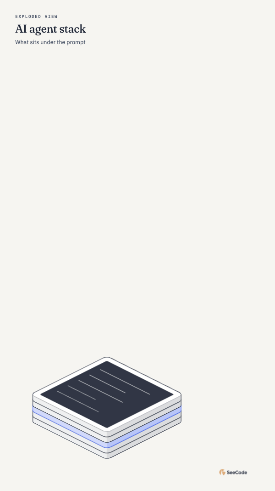</a><br><b>AI agent stack</b><br><sub>Vault, tools, skills, harness, interface</sub></td>
</tr>
<tr>
  <td align="center" width="33%"><a href="docs/screenshots/burger.png">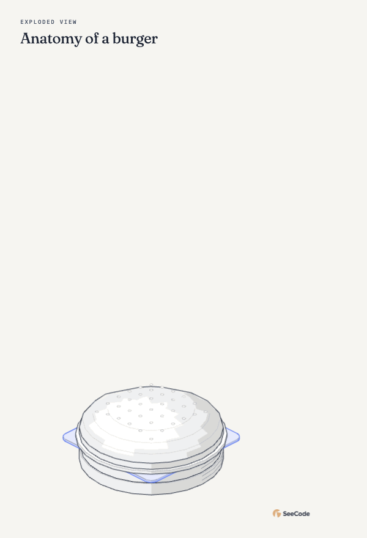</a><br><b>Anatomy of a burger</b><br><sub>Domed bun with sesame, ribbed layers</sub></td>
  <td align="center" width="33%"><a href="docs/screenshots/server-rack.png">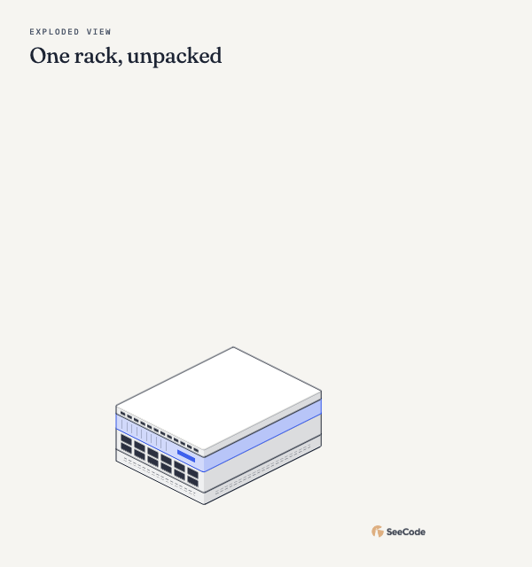</a><br><b>One rack, unpacked</b><br><sub>Ports, drive bays and vents on the walls</sub></td>
  <td align="center" width="33%"><a href="docs/screenshots/office-floors.png">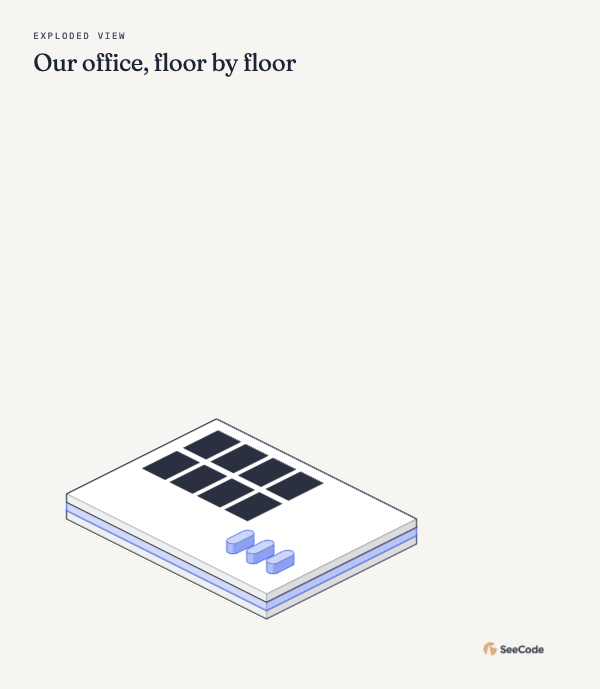</a><br><b>Office, floor by floor</b><br><sub>Desks, monitors, solar panels</sub></td>
</tr>
<tr>
  <td align="center" width="33%"><a href="docs/screenshots/isometric-plan.png"></a><br><b>North campus</b><br><sub>Buildings, roads and trees, by phase</sub></td>
  <td align="center" width="33%"><a href="docs/screenshots/coffee-shop.png">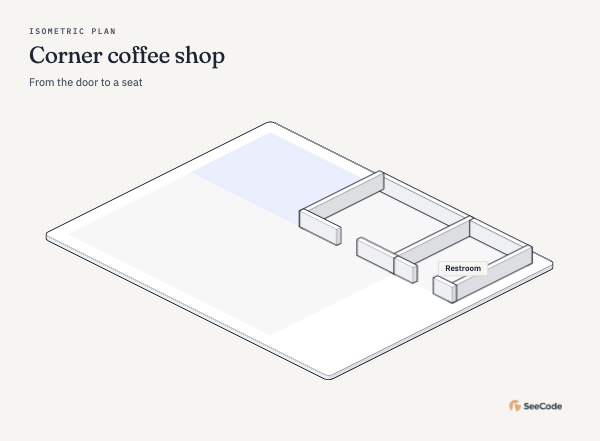</a><br><b>Corner coffee shop</b><br><sub>Bar, kitchen, tables, queue posts</sub></td>
  <td align="center" width="33%"><a href="docs/screenshots/street.png">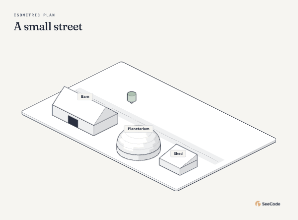</a><br><b>A small street</b><br><sub>Gable, hip and shed roofs, a dome</sub></td>
</tr>
</table>

<sub>Also in the gallery: a fulfilment warehouse with storage racks. Specs are in <a href="examples/specs/isometric/">examples/specs/isometric</a>.</sub>

### Not just code

The same types draw everyday things: a leave plan, where your pay goes, a back-and-forth with a landlord, where a job application stands. Labels can be in any language (set `lang`, and Chinese, Japanese and Korean labels wrap between characters), and the legend can use your own words.

<table>
<tr>
  <td align="center" width="50%"><a href="docs/screenshots/leave-plan.png">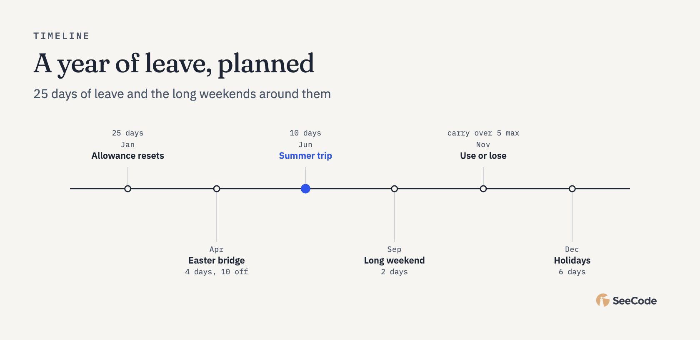</a><br><b>A year of leave</b><br><sub>Timeline</sub></td>
  <td align="center" width="50%"><a href="docs/screenshots/monthly-money.png">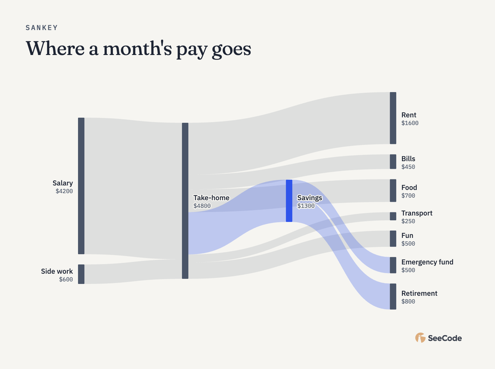</a><br><b>Where the pay goes</b><br><sub>Sankey</sub></td>
</tr>
<tr>
  <td align="center" width="50%"><a href="docs/screenshots/renting.png">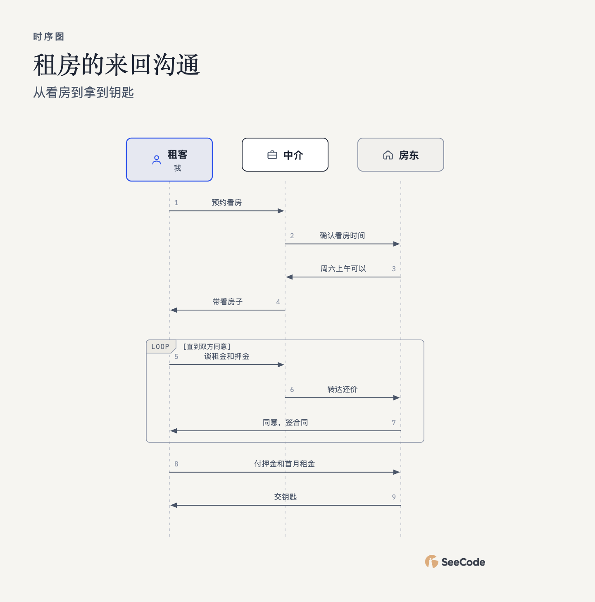</a><br><b>租房的来回沟通</b> (renting)<br><sub>Sequence, in Chinese</sub></td>
  <td align="center" width="50%"><a href="docs/screenshots/job-search.png">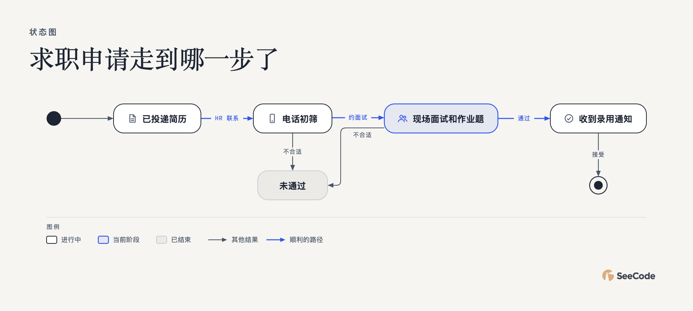</a><br><b>求职申请走到哪一步了</b> (job search)<br><sub>State, in Chinese, with a custom legend</sub></td>
</tr>
</table>

## See it in action

Every HTML diagram is one self-contained file you can explore. Send it to anyone and the interactions go with it. These clips are recorded from real diagrams:

<table>
<tr>
  <td width="50%" valign="top">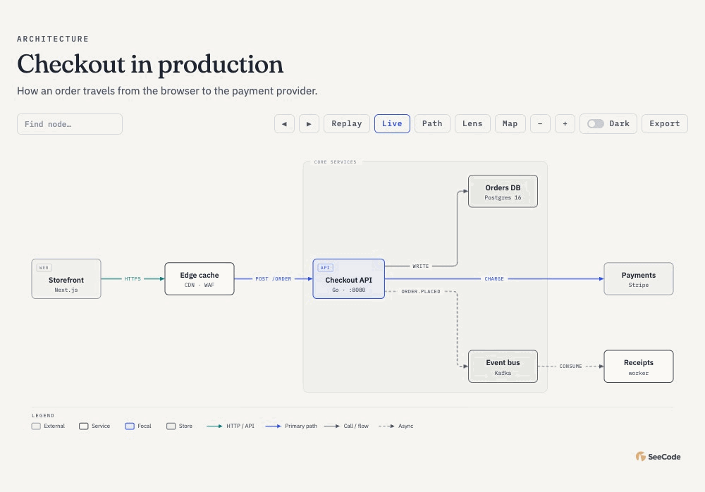<br><b>Hover to trace</b><br><sub>Point at a node and its connections light up with a moving trace: outgoing in the accent colour, incoming in teal. Everything else steps back.</sub></td>
  <td width="50%" valign="top">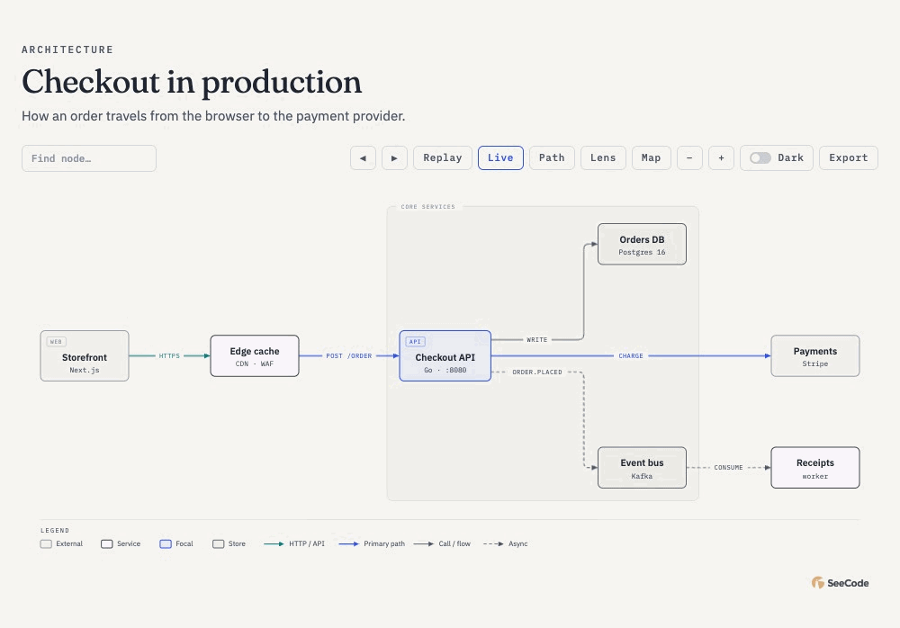<br><b>Click to focus</b><br><sub>The camera zooms in and a panel opens with the node's role, reach and every connection. Hover a connection to send a token along it, or show everything downstream.</sub></td>
</tr>
<tr>
  <td width="50%" valign="top">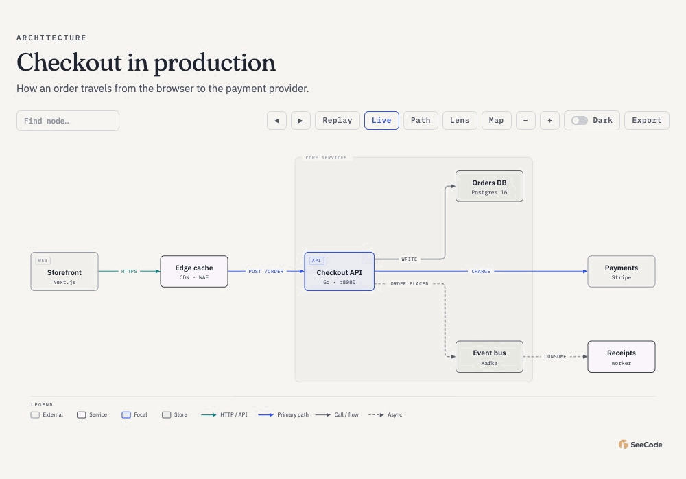<br><b>Walk a route</b><br><sub>Pick a start and an end, press Play, and the camera follows the request hop by hop, with each step listed in the panel.</sub></td>
  <td width="50%" valign="top">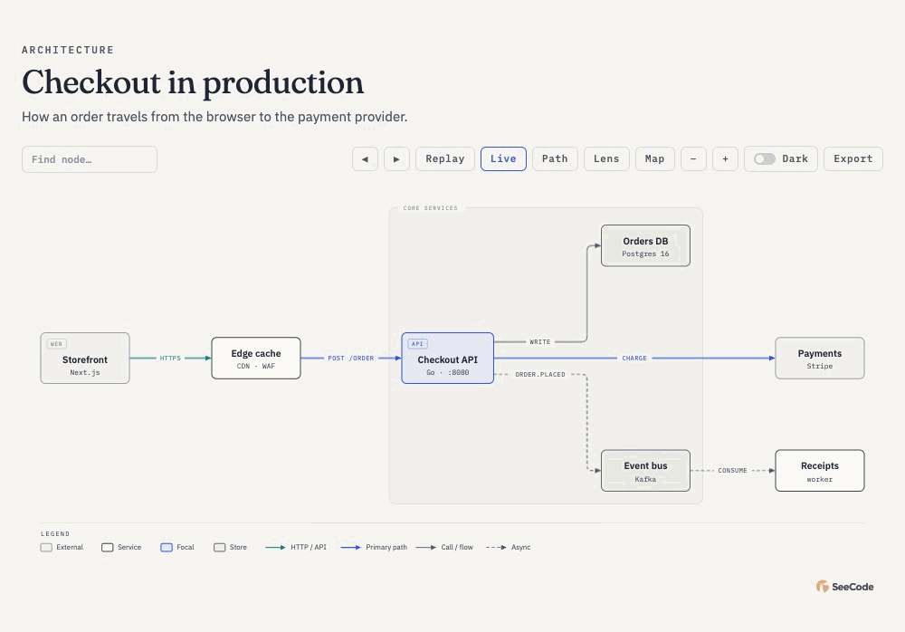<br><b>Look through a lens</b><br><sub>Highlight one kind of node or connection (async events, the primary path, stores) to read one layer of the system at a time.</sub></td>
</tr>
<tr>
  <td width="50%" valign="top">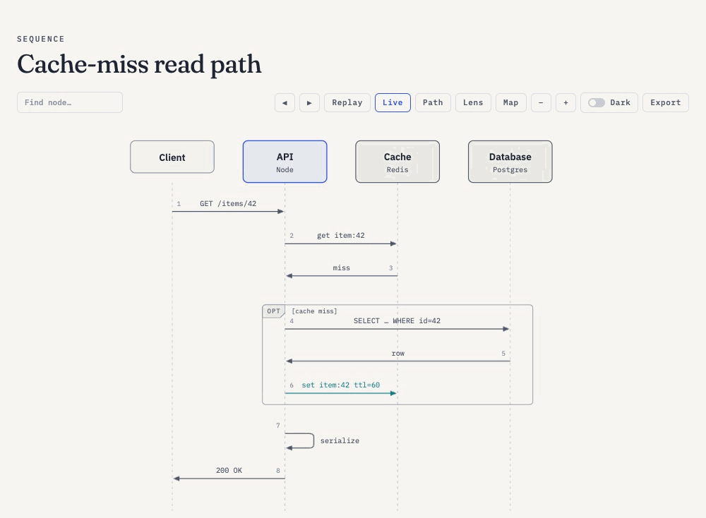<br><b>Step through it</b><br><sub>Use <kbd>←</kbd> <kbd>→</kbd> to walk the diagram's build-up one step at a time, which is ideal for presenting.</sub></td>
  <td width="50%" valign="top">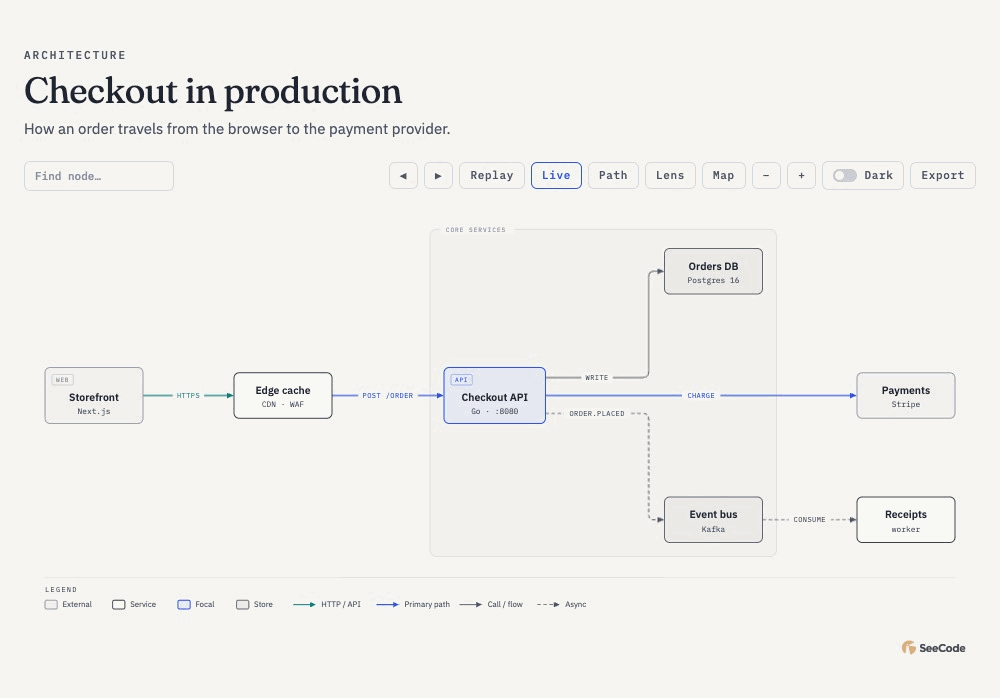<br><b>Theme it, export it</b><br><sub>Flip the dark-mode switch. The Export menu saves PNG, JPEG, SVG, GIF and MP4 straight from the page, with nothing installed.</sub></td>
</tr>
<tr>
  <td width="50%" valign="top">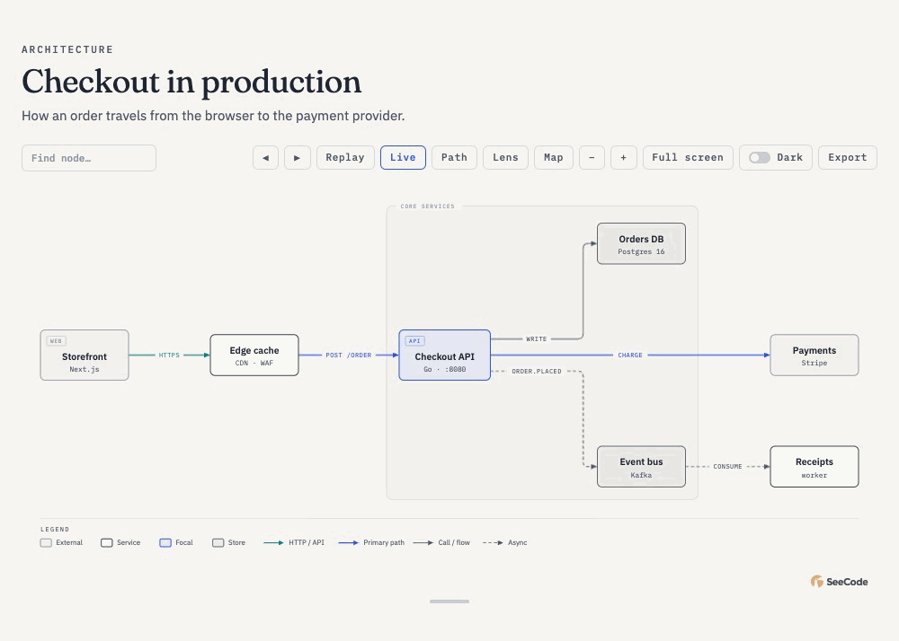<br><b>Give it room</b><br><sub>Drag the grip under the diagram to make the canvas taller, or press <b>Full screen</b> (<kbd>F</kbd>) to zoom and pan across the whole display. <kbd>Esc</kbd> brings you back.</sub></td>
  <td width="50%" valign="top"></td>
</tr>
</table>

Also: a dark-mode switch, search, pan and zoom, a clickable overview map, and links that reopen a view (`#focus=api`, `#route=web,db`). <kbd>Esc</kbd> clears focus, routes and lenses, and reduced-motion settings are respected.

## Themes, and your brand

Light and dark come built in, and every diagram has a dark-mode switch that starts on your system setting. Dark mode is a soft `#1a1a1a`, never pure black. Point SeeCode at your site or your design tokens and it learns your brand palette too.

<table>
<tr>
  <td width="33%" valign="top">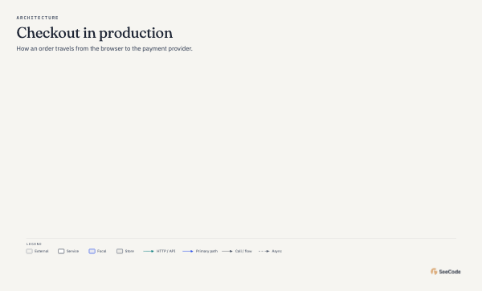<br><b>Light</b><br><sub>Warm paper, ink-dark text, one blue accent for what matters.</sub></td>
  <td width="33%" valign="top">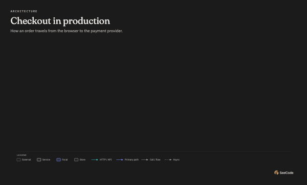<br><b>Dark</b><br><sub>Neutral <code>#1a1a1a</code> background, tuned so every label keeps its contrast.</sub></td>
  <td width="33%" valign="top">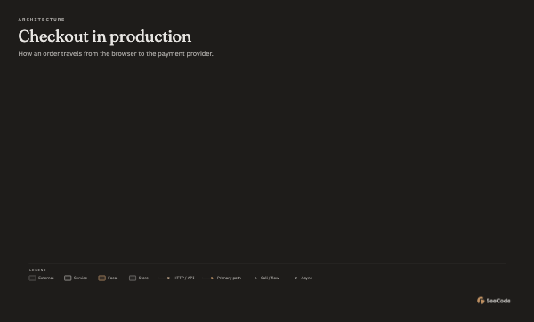<br><b>Your brand</b><br><sub>Learned from a site, CSS tokens or a list of colours. Shown here:<br>  </sub></td>
</tr>
</table>

Tell your agent where your brand lives, in any of three ways:

```text
Use SeeCode with our brand: https://your-site.com
```

<sub>Replace `https://your-site.com` with your own website.</sub>

```text
Use SeeCode with the brand colours in this repo's CSS.
```

```text
Use SeeCode with these colours: #D4A574, #E7E5E2, #1E1C1A.
```

SeeCode reads the page and its stylesheets (or your repo's CSS, Tailwind and theme files) and works out which colour is the background, the text, the accent and the links, and which typefaces your body text, headings and code use. It builds a light and a dark version and fixes contrast where a brand colour would be hard to read: tan on off-white is deepened for light mode, while dark mode keeps it exactly. It then shows you the palette before saving it as a profile. No brand? Diagrams use the built-in themes. [How brand onboarding works](skills/seecode/references/onboarding.md)

## Bring what you already have

Point SeeCode at an existing diagram or data file and it **redraws** it: same content, SeeCode's layout and style, at the level of detail you ask for.

```text
Turn docs/architecture.mmd into a SeeCode diagram for my deck, simplified for executives.
```

| Source | Files |
|---|---|
| Mermaid (every diagram kind) | `.mmd`, `.mermaid`, fenced blocks in `.md` |
| Graphviz · PlantUML · D2 | `.dot` `.gv` · `.puml` `.plantuml` · `.d2` |
| draw.io · Excalidraw | `.drawio` (also `.drawio.png`/`.svg`) · `.excalidraw` |
| Structurizr · BPMN | `.dsl` · `.bpmn` |
| SQL · Prisma · DBML | `.sql` · `.prisma` · `.dbml` |
| OpenAPI · data | `.yaml`/`.json` · `.csv` `.tsv` `.json` |

**One file, many diagrams?** A design doc with several Mermaid blocks, a draw.io file with several pages or a board with frames comes out as a folder, one diagram per file, numbered in order and named after its heading or page, plus an `index.html` to browse them:

```text
Use SeeCode to redraw every diagram in docs/design.md and export them for Confluence.
```

```text
diagrams/design/
  01-request-flow.html   01-request-flow.svg   01-request-flow.png
  02-payment-sequence.html   …
  index.html
```

You get a short report of what was merged or dropped. Source colours, fonts and coordinates never carry over. Or point it at code: *"diagram this repo"* scans the repository first, and each node can link back to the files it came from.

## Export for wherever it goes

SeeCode works out where the diagram will live and picks the output to match:

| Where it goes | You get |
|---|---|
| Explaining how something works, an artifact, a share link | **Interactive HTML** (motion, trace, focus, journey) |
| PDF, Word, print | **SVG** with embedded fonts, plus a high-res PNG |
| README, docs site, Notion, Confluence | SVG, plus a GIF if you want motion |
| PowerPoint, Keynote, Google Slides | SVG or PNG |
| Slack, X, LinkedIn, talks | PNG, **GIF** or **MP4** |

Every diagram carries a small SeeCode mark in its bottom-right corner, drawn in the diagram's own text colour so it reads on any background. Ask to remove it and it's gone.

Nothing to install. The diagram's own **Export** menu makes PNG, JPEG, SVG, GIF and MP4 in the browser. From the command line, SVG needs only Node, and the other formats use the Chrome or Edge you already have.

The size adapts to the content: each format gets the resolution that keeps the smallest label readable while keeping the file practical. A small chart comes out at 3×, a dense system map at whatever keeps its labels sharp, GIFs stay compact and MP4s stay within 4K. [Export details](skills/seecode/references/export.md)

<table>
<tr>
  <td width="50%">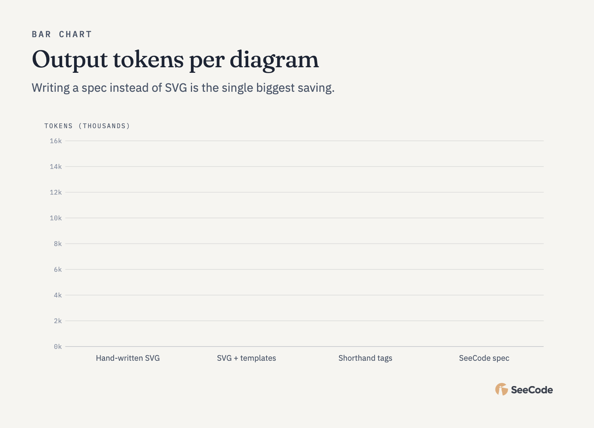</td>
  <td width="50%"></td>
</tr>
</table>

## Why it looks good every time

- **The model never draws SVG.** Your agent writes 30 to 150 lines of JSON: what's there, how it connects, roughly where. SeeCode's renderers handle layout, edge routing, label placement, typography, accessibility and motion.
- **Editorial by default.** One accent colour for what matters most, hairline borders, no shadows, and a complexity budget that pushes back on clutter.
- **Mistakes come with fixes.** Problems come back as one line each with a fix hint, and repairs are small patches instead of rewrites.
- **Light on tokens.** About 1.4k agent tokens per diagram, against roughly 15k when a model writes the SVG itself.
- **Yours to style.** Light, dark and terminal skins, a sketchy hand-drawn style, and brand colours and fonts learned from your site or design tokens.

## When *not* to use it

- A list of things: use a table or bullets.
- A before/after of attributes: use a table.
- One box with a label: write the sentence.

If a reader wouldn't learn more from the picture than from a good paragraph, skip the diagram.

## Install

**Claude Code** (plugin, auto-updates):

```text
/plugin marketplace add Aryanutkarsh/seecode
/plugin install seecode@seecode
```

Run `/plugin` → **Marketplaces** → **seecode** → **Enable auto-update** once. The plugin also adds `/seecode:export`, `/seecode:import`, `/seecode:doctor` and `/seecode:settings`.

<details>
<summary><b>Any Agent Skills host, Codex, Copilot, Claude.ai, manual install</b></summary>

**Any Agent Skills host** (Claude Code, Cursor, Codex, OpenCode…) via [skills.sh](https://skills.sh):

```bash
npx skills add Aryanutkarsh/seecode -g
```

**Codex:**

```bash
codex plugin marketplace add Aryanutkarsh/seecode
codex plugin add seecode@seecode
```

**GitHub Copilot:**

```bash
copilot plugin marketplace add Aryanutkarsh/seecode
copilot plugin install seecode@seecode
```

**Claude.ai / Claude Desktop:** download `seecode.zip` from the [latest release](https://github.com/Aryanutkarsh/seecode/releases/latest) and upload it under **Settings → Capabilities → Skills**. Everything works there; image and video files come from the diagram's own Export menu, since the sandbox has no browser.

**Manual:**

```bash
git clone https://github.com/Aryanutkarsh/seecode ~/code/seecode
ln -s ~/code/seecode/skills/seecode ~/.claude/skills/seecode
```

Requires Node 20 or later. Check your setup with `/seecode:doctor` or `node skills/seecode/scripts/seecode.mjs doctor`.

</details>

### Updating

Every change merged to `main` ships as a new version, with a [release](https://github.com/Aryanutkarsh/seecode/releases) and a fresh `seecode.zip`. How you pick it up depends on how you installed:

| Installed with | To update |
|---|---|
| Claude Code plugin | Automatic once auto-update is on (`/plugin` → **Marketplaces** → **seecode** → **Enable auto-update**). To update now: `/plugin` → **Marketplaces** → **seecode** → **Update** |
| `npx skills add` | `npx skills update seecode -g` (drop `-g` for a project install). Skills installed this way don't update on their own |
| Codex / Copilot plugin | Update the plugin from your agent's plugin manager, or run the install commands above again |
| Claude.ai / Claude Desktop | Download `seecode.zip` from the [latest release](https://github.com/Aryanutkarsh/seecode/releases/latest) and upload it again under **Settings → Capabilities → Skills** |
| Manual clone | `git pull` in the clone (the symlink picks it up) |

Then start a new agent session: skills load when a session starts. To see which version you have, check the `version:` line at the top of the installed `SKILL.md`, or run `/seecode:doctor`.

## Learn more

- [CLI reference and how the pipeline works](docs/cli.md)
- [Skill instructions](skills/seecode/SKILL.md) · [type guides](skills/seecode/references/types/) · [settings](skills/seecode/references/settings.md)
- [Example specs](examples/specs/)

## Contributing

Issues, pull requests and new diagram types are welcome. Start with the [contribution guide](CONTRIBUTING.md), and please follow the [code of conduct](CODE_OF_CONDUCT.md). Report security problems privately as described in [SECURITY.md](SECURITY.md).

## Privacy

SeeCode has no server, accounts or telemetry. Generated diagrams load their fonts from Google Fonts, and the in-page GIF/MP4 export loads its encoders from jsDelivr. [PRIVACY.md](PRIVACY.md) lists every request.

## Acknowledgements

SeeCode learned a great deal from excellent open-source projects: [diagram-design](https://github.com/cathrynlavery/diagram-design) by Cathryn Lavery, for its editorial approach to diagram types and its isometric projection, and [archify](https://github.com/tt-a1i/archify) by tt-a1i, for its explorable, animated viewer. The isometric object type was also inspired by [iso-glow](https://isoglow.dev) by April Zhu ([@Aprilzz423](https://x.com/Aprilzz423)) and [iso-figure](https://github.com/MrBongoC/ai-iso-skill) by Tolga Cohce, which showed how far isometric figures built from simple parts can go. All of these are MIT licensed; SeeCode's code is its own. Thank you all.

If SeeCode is useful to you, a ⭐ helps others find it.

## License

[MIT](LICENSE). Bundled encoders and fonts are listed in [THIRD_PARTY_LICENSES.md](THIRD_PARTY_LICENSES.md).

<p align="center"></p>
