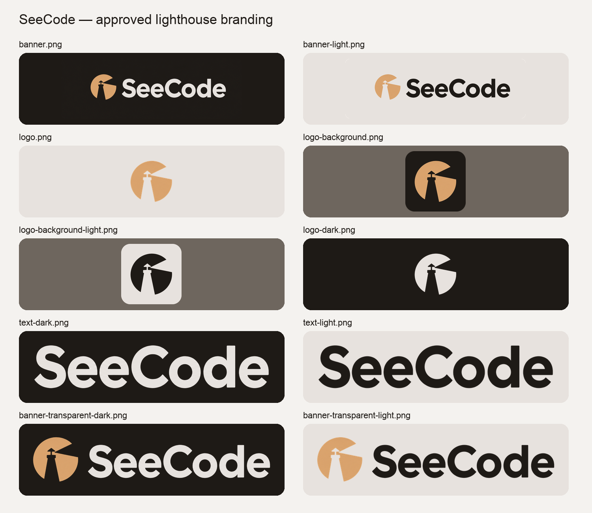

# SeeCode branding

The approved lighthouse B artwork is the SeeCode logo. These exports use its original symbol and lettering; no logo elements were regenerated or redrawn. Background removal retains the source silhouette, with antialiasing at the edges. The untouched original is saved as `source-banner.png`.

## Asset guide

The `light` and `dark` suffixes describe the **theme where the asset should be used**, rather than the color of the artwork. All files are PNGs. Background variants have smooth rounded corners with transparent pixels outside the corners.

| File | Size | Use |
| --- | --- | --- |
| `logo.png` | 512 × 512 | Original tan symbol on transparency; default logo |
| `logo-light.png` | 512 × 512 | Charcoal symbol on transparency for light themes |
| `logo-dark.png` | 512 × 512 | Light symbol on transparency for dark themes |
| `logo-background.png` | 512 × 512 | Tan symbol on a rounded charcoal tile |
| `logo-background-light.png` | 512 × 512 | Charcoal symbol on a rounded light tile |
| `banner.png` | 2172 × 724 | Approved tan symbol and light lettering with the original charcoal background, rounded corners |
| `banner-light.png` | 2172 × 724 | Tan symbol and charcoal lettering on a rounded light background |
| `banner-transparent-dark.png` | 1687 × 369 | Tan symbol and light lettering, transparent, for dark themes |
| `banner-transparent-light.png` | 1687 × 369 | Tan symbol and charcoal lettering, transparent, for light themes |
| `text-dark.png` | 1311 × 292 | Original light SeeCode lettering only, transparent |
| `text-light.png` | 1311 × 292 | Charcoal SeeCode lettering only, transparent |
| `watermark-dark.png` | 293 × 64 | Small transparent logo and wordmark for dark diagrams |
| `watermark-light.png` | 293 × 64 | Small transparent logo and wordmark for light diagrams |
| `favicon.png` | 64 × 64 | Tan symbol on transparency |
| `source-banner.png` | 2172 × 724 | Untouched approved original |
| `preview.png` | 1500 × 1300 | Comparison sheet; not a production logo |

## Usage

Use `logo.png` when only the symbol is needed. For diagram corners, use the watermark matching the diagram theme, or a transparent banner when more resolution is needed. Leave at least 12 px between the artwork and the diagram edge at the watermark's native size. Keep the original aspect ratio when resizing.

The lighthouse and beam are negative space: transparent versions reveal the surface behind them. Use the rounded background tile when the logo needs a consistent background on busy surfaces.

The original artwork contains subtle shading. Theme variants retain the tan and light artwork; recolored elements use charcoal `#1E1A16` and light `#E7E2DE`, sampled from the approved source. The tan reference color is approximately `#DAA46D`.

Earlier concepts and export drafts are archived in the root `logo-iterations/` folder, which is excluded by `.gitignore`.
