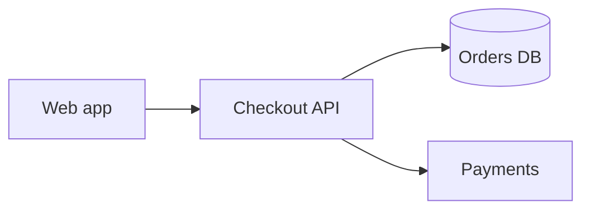
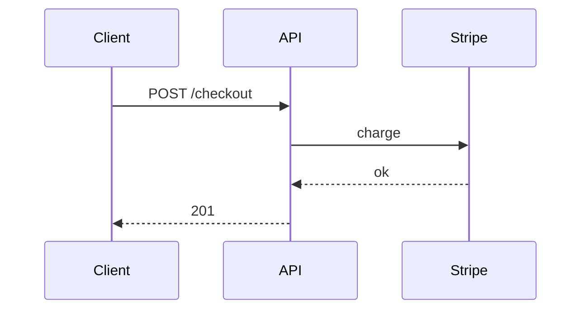
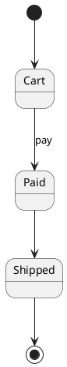

# Checkout design

Some context about the system.

## Request flow

```mermaid
flowchart LR
  web[Web app] --> api[Checkout API]
  api --> db[(Orders DB)]
  api --> pay[Payments]
```

## Payment sequence

```mermaid
sequenceDiagram
  participant C as Client
  participant A as API
  participant S as Stripe
  C->>A: POST /checkout
  A->>S: charge
  S-->>A: ok
  A-->>C: 201
```

## Order lifecycle

```plantuml
@startuml
[*] --> Cart
Cart --> Paid : pay
Paid --> Shipped
Shipped --> [*]
@enduml
```
